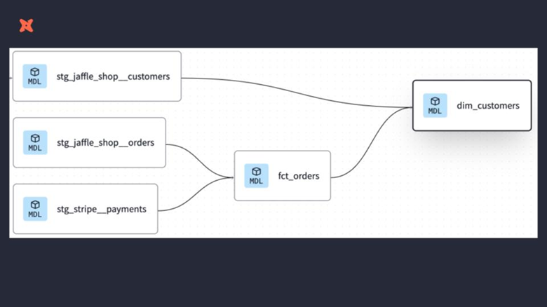
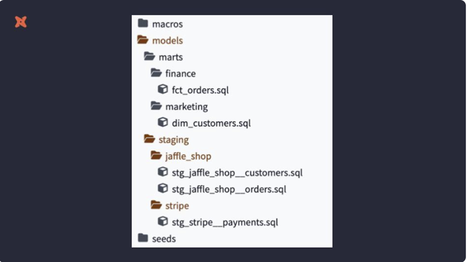

# `dbt-core` Fundamentals Tutorial

dbt-core Fundamentals template in PostgreSQL and podman

[](https://docs.getdbt.com/dbt-cli/cli-overview)
[](https://www.postgresql.org/)
[](https://www.python.org/)
[](https://www.docker.com/)

  This `dbt-core` quickstart taken from the various [dbt Developer Hub](https://docs.getdbt.com/guides) and [dbt courses](https://courses.getdbt.com/collections), using `PostgreSQL` as the data warehouse. There you are going to find the following  course:

- [dbt Fundamentals](https://courses.getdbt.com/courses/fundamentals)
- [Jinja, Macros, Packages](https://courses.getdbt.com/courses/jinja-macros-packages)
- [Advanced Materializations](https://courses.getdbt.com/courses/advanced-materializations)
- [Analyses and Seeds](https://courses.getdbt.com/courses/analyses-seeds)
- [Refactoring SQL for Modularity](https://courses.getdbt.com/courses/refactoring-sql-for-modularity)

In this tutorial, for the purpose of `dbt-core` exercises, I made some modifications to the `profiles.yml` file to use the local `PostgreSQL` repository.

- [`dbt-core` Fundamentals Tutorial](#dbt-core-fundamentals-tutorial)
  - [Preparation](#preparation)
    - [Create repository](#create-repository)
    - [Create venv with dbt](#create-venv-with-dbt)
    - [Start database](#start-database)
    - [Project Set Up](#project-set-up)
    - [dbt command brief](#dbt-command-brief)
  - [Models](#models)
    - [Overview](#overview)
    - [Modularity](#modularity)
    - [Naming Conventions](#naming-conventions)
    - [Project Reorganization](#project-reorganization)
    - [Exercise](#exercise)
    - [Summary](#summary)
  - [Data Sources](#data-sources)
    - [Overview](#overview-1)
    - [Configuring sources](#configuring-sources)
    - [Source function](#source-function)
    - [Source freshness](#source-freshness)
    - [Exercise](#exercise-1)
    - [Summary](#summary-1)
  - [Tests](#tests)
    - [Overview](#overview-2)
    - [dbt test function](#dbt-test-function)
    - [dbt test command](#dbt-test-command)
    - [Exercise](#exercise-2)
    - [Summary](#summary-2)
  - [Documentation](#documentation)
    - [Overview](#overview-3)
    - [documentation and doc blocks](#documentation-and-doc-blocks)
    - [Generating and viewing documentation](#generating-and-viewing-documentation)
    - [Exercise](#exercise-3)
    - [Summary](#summary-3)
  - [Deployment](#deployment)
    - [Overview](#overview-4)
    - [dbt-cloud](#dbt-cloud)
    - [dbt-core](#dbt-core)

## Preparation

### Create repository

1. Create a new GitHub repository

- Find our Github template repository [dbt-fundamental-template](https://github.com/saastoolset/dbt-fundamental-template)
- Click the big green 'Use this template' button and 'Create a new repository'.
- Create a new GitHub repository named **dbt-fund-ex1**.


1. Select Public so the repository can be shared with others. You can always make it private later.
2. Leave the default values for all other settings.
3. Click Create repository.
4. Save the commands from "…or create a new repository on the command line" to use later in Commit your changes.
5. Install and setup envrionment

### Create venv with dbt

Skip this step if already create dbt venv

- Create python virtual env for dbt
  - For venv and and docker, using the [installation instructions](https://docs.getdbt.com/docs/core/installation-overview) for your operating system.
  - For conda in Windows, open conda prompt terminal in ***system administrador priviledge***

  ```command
  conda create -n dbt dbt-core dbt-postgres
  conda activate dbt
  ```

### Start database

- Start up db and pgadmin
  . use admin/Passw0rd as connection

  ```command
  cd C:\Proj\CUB-EDW\50-GIT\dbt-fund-ex1
  bin\db-start-pg.bat
  ```

### Project Set Up

- Init project in repository home directory
  Initiate the jaffle_shop project using the init command:

```command
dbt init jaffle_shop
```

- Connect to PostgreSQL

- Update `profiles.yml`
Now we should create the `profiles.yml` file on the `C:\Users\YourID\.dbt` directory. The file should look like this:

```YAML
config:
    use_colors: True 
jaffle_shop:
  outputs:
    dev:
      type: postgres
      threads: 1
      host: localhost
      port: 5432
      user: "admin"
      pass: "Passw0rd"
      dbname: raw
      schema: jaffle_shop
    prod:
      type: postgres
      threads: 1
      host: localhost
      port: 5432
      user: "admin"
      pass: "Passw0rd"
      dbname: raw
      schema: analytics
  target: dev
```

- Test connection config

```
cd jaffle_shop
dbt debug
```

- Load sample data
  
  We should copy this data from the `db/seeds` directory.

  - Edit `dbt_project.yml`
  Now we should create the `dbt_project.yml` file on the `jaffle_shop` directory. Append following config:

  ```YAML
  seeds:
    jaffle_shop:
      +schema: seeds
  ```

  - copy seeds data

  ```command
  copy ..\db\seeds\*.csv seeds
  dbt seed  
  ```

  - create source table

  ```command
  ..\bin\db-psql raw bin/init_src.sql
  ```

- Verfiy result in database client
This command will spin and will create the `dbt_seeds` schema, and create and insert the `.csv` files to the following tables:

- `dbt_seeds.customers`
- `dbt_seeds.orders`
- `dbt_seeds.payments`

To meet train course scenario, copy to source table, verify following tables:

- `jaffle_shop.customers`
- `jaffle_shop.orders`
- `strip.payments`

### dbt command brief

To run `dbt`, we just execute, inside `jaffle_shop` directory

```command
dbt run --profiles-dir .
```

This will run all the modles defined on the `models` directory.

In case you only want to run 1 model, you can execute

```command
dbt run -m FILE_NAME --profiles-dir .
```

In case you only want to run 1 model and all the other ones that depends on it, you can execute

```command
dbt run -m FILE_NAME+ --profiles-dir .
```

In case you only want to run 1 model and all the previous ones, you can execute

```command
dbt run -m +FILE_NAME --profiles-dir .
```

In case you only want to run 1 model, all the previous ones and all the dependencies, you can execute

```command
dbt run -m +FILE_NAME+ --profiles-dir .
```

To compile the queries, we can run:

```command
dbt compile --profiles--dir .
```

That command will save the compiled queries on `target/compiled/PROJECT_NAME/models` directory

## Models

### Overview

- Models are .sql files that live in the models folder.
- After constructing a model, dbt run in the command line will actually materialize the models into the data warehouse. The default materialization is a view.

### Modularity

- Modularity is the degree to which a system's components may be separated and recombined



### Naming Conventions

- source(src): raw tables that are stored form differnet processes on the warehouse.
- staging(stg): 1to1 with source table, where some minimal transformations can be done.
- intermediate(int): models between staging and final models (always built on staging)
- fact tables(fct): things that are ocurring or have ocurred (events)
- dimension tables(dim): things that "are" or "exists" (people, places, etc)

### Project Reorganization

- create folders inside `models` directory:
  - staging: will store all th staging models
    - one folder per schema, onde file per table
  - mart: will store the final outputs aht are modeled.
    - a best practice is to create a folder inside mart, per area (marketing, finance, etc)
- use the `ref` function to reference to another model (a staging table or a dim table or a fcat table)

### Exercise

- create project folder as:



- ex-1.1 Legancy SQL
  - Create  a marts/marketing/dim_customers.sql model

  ```SQL
  with customers as (

    select
      id as customer_id,
      first_name,
      last_name

    from jaffle_shop.customers
  ),

  orders as ( 

    select
      id as order_id,
      user_id as customer_id,
      order_date,
      status

    from jaffle_shop.orders

  ),

  customer_orders as (

      select
          customer_id,

          min(order_date) as first_order_date,
          max(order_date) as most_recent_order_date,
          count(order_id) as number_of_orders

      from orders

      group by 1

  ),

  final as (

      select
          customers.customer_id,
          customers.first_name,
          customers.last_name,
          customer_orders.first_order_date,
          customer_orders.most_recent_order_date,
          coalesce (customer_orders.number_of_orders, 0) 
          as number_of_orders

      from customers

      left join customer_orders using (customer_id)

  )

  select * from final

  ```

- ex-1.2  create stg sql:
  - Create a stg_jaffle_shop__customers.sql model for jaffle_shop.customers

    ***stg_jaffle_shop__customers.sql***

    ```SQL
    select
        id as customer_id,
        first_name,
        last_name

    from jaffle_shop.customers
    ```

  - Create a stg_jaffle_shop__orders.sql model for jaffle_shop.orders
  
    ***stg_jaffle_shop__orders.sql***

    ```SQL
    select
    id as order_id,
    user_id as customer_id,
    order_date,
    status

    from jaffle_shop.orders
    ```

  - Mart Models
    - Update a marts/marketing/dim_customers.sql model

    ***dim_customers.sql***

    ```SQL
    with customers as (

        select * from {{ ref('stg_jaffle_shop__customers') }}

    ),

    orders as ( 

        select * from {{ ref('stg_jaffle_shop__orders') }}

    ),

    customer_orders as (

        select
            customer_id,

            min(order_date) as first_order_date,
            max(order_date) as most_recent_order_date,
            count(order_id) as number_of_orders

        from orders

        group by 1

    ),

    final as (

        select
            customers.customer_id,
            customers.first_name,
            customers.last_name,
            customer_orders.first_order_date,
            customer_orders.most_recent_order_date,
            coalesce (customer_orders.number_of_orders, 0) 
            as number_of_orders

        from customers

        left join customer_orders using (customer_id)

    )

    select * from final
    ```

- ex-1.3  Configure your materializations

  - In your dbt_project.yml file, configure the staging directory to be materialized as views.

  ```YAML
  models:
    jaffle_shop:
      staging:
        +materialized: view
  ```

  - In your dbt_project.yml file, configure the marts directory to be materialized as tables.

  ```YAML
  models:
    jaffle_shop:
    ...
      marts:
        +materialized: table
  ```

- ex-1.4  create stg sql for payments

  ***staging/stripe/stg_stripe__payments.sql***

  ```SQL
  select
      id as payment_id,
      orderid as order_id,
      paymentmethod as payment_method,
      status,

      -- amount is stored in cents, convert it to dollars
      amount / 100 as amount,
      created as created_at

  from stripe.payment 
  ```

  ***marts/finance/fct_orders.sql***

  ```SQL
  with orders as  (
      select * from {{ ref ('stg_jaffle_shop__orders' )}}
  ),

  payments as (
      select * from {{ ref ('stg_stripe__payments') }}
  ),

  order_payments as (
      select
          order_id,
          sum (case when status = 'success' then amount end) as amount

      from payments
      group by 1
  ),

  final as (

      select
          orders.order_id,
          orders.customer_id,
          orders.order_date,
          coalesce (order_payments.amount, 0) as amount

      from orders
      left join order_payments using (order_id)
  )

  select * from final
  marts/marketing/dim_customers.sql 
  ```

  *Note: This is different from the original dim_customers.sql - you may refactor fct_orders in the process.

***dim_customers.sql***

```SQL
with customers as (
    select * from {{ ref ('stg_jaffle_shop__customers')}}
),
orders as (
    select * from {{ ref ('fct_orders')}}
),
customer_orders as (
    select
        customer_id,
        min (order_date) as first_order_date,
        max (order_date) as most_recent_order_date,
        count(order_id) as number_of_orders,
        sum(amount) as lifetime_value
    from orders
    group by 1
),
 final as (
    select
        customers.customer_id,
        customers.first_name,
        customers.last_name,
        customer_orders.first_order_date,
        customer_orders.most_recent_order_date,
        coalesce (customer_orders.number_of_orders, 0) as number_of_orders,
        customer_orders.lifetime_value
    from customers
    left join customer_orders using (customer_id)
)
select * from final

```

### Summary

Changes in `dbt_project.yml`:

- Here you can choose the materialization of each dataproduct (table, view, incremental). The default one is view. The reference schemas also required review as needs.
-
- Those option can be overriden on each `.sql` file.

## Data Sources

### Overview

- Sources represent the raw data that is loaded into the data warehouse.
- Function to support source macro
  - Multiple tables from a single source can be configured in one place.
  - Sources are easily identified as green nodes in the Lineage Graph.
  - You can use dbt source freshness to check the freshness of raw tables.

### Configuring sources

- Sources are configured in YML files in the models directory.
- View the full documentation for configuring sources on the source properties page of the docs.

### Source function

- Similarly as ref{{}} macro, the source function is used to build the dependency of one model to a source.
- The Lineage Graph will represent the sources in green.

### Source freshness

- Freshness thresholds can be set in the YML file where sources are configured. For each table, the keys loaded_at_field and freshness must be configured.
- A threshold can be configured for giving a warning and an error with the keys warn_after and error_after.
- The freshness of sources can then be determined with the command dbt source freshness.

### Exercise

- Ex2.1 Configure sources
  - Configure a source for the tables jaffle_shop.customers and jaffle_shop.orders in a file called src_jaffle_shop.yml.

  ***models/staging/jaffle_shop/src_jaffle_shop.yml***

 ```yaml
  version: 2

  sources:
    name: jaffle_shop
      database: raw
      schema: jaffle_shop
      tables:
        name: customers
        name: orders  
 ```
- Refactor staging models
    Refactor stg_jaffle_shop__customers.sql using the source function.

***models/staging/jaffle_shop/stg_jaffle_shop__customers.sql***

```yaml
  select 
      id as customer_id,
      first_name,
      last_name
  from {{ source('jaffle_shop', 'customers') }}
  Refactor stg_jaffle_shop__orders.sql using the source function.
  models/staging/jaffle_shop/stg_jaffle_shop__orders.sql

  select
      id as order_id,
      user_id as customer_id,
      order_date,
      status
  from {{ source('jaffle_shop', 'orders') }}

```

- You can configure your ***src_stripe.yml*** file as below:

```yaml
version: 2

sources:
  - name: stripe
    database: raw
    schema: stripe
    tables:
      - name: payment
        loaded_at_field: _batched_at
        freshness:
          warn_after: {count: 12, period: hour}
          error_after: {count: 24, period: hour}

```

- Ex2.2 check your work

  ***models/staging/stripe/src_stripe.yml***

  ```yaml
  version: 2

  sources:
    - name: stripe
      database: raw
      schema: stripe
      tables:
        - name: payment
  models/staging/stripe/stg_payments.sql

  select
      id as payment_id,
      orderid as order_id,
      paymentmethod as payment_method,
      status,
      -- amount is stored in cents, convert it to dollars
      amount / 100 as amount,
      created as created_at
  from {{ source('stripe', 'payment') }}

  ```

### Summary

- configure the source data only once in a `.yml` file
- we use the `source` function to reference to the source table from the `.yml`
- visualize the raw tables in the lineage on dbt Cloud UI

## Tests

### Overview

The tests are data validations that are performed after the data is loaded to the warehouse.

### dbt test function

 On `dbt` there are two types of tests:

- singular tests:
  - they are defined as a `.sql` file inside the `tests` directory
  - super specific tests that are olny valid for one model in particular
- generic tests:
   they are defined on a `.yml` file inside the `models` directory, for particular tables/columns
  - unique
  - not null
  - accepted_values
  - relationships

- You can also test the source tables, by adding the generic tests on the source .yml, or by creaeting the custom `.sql` query on `tests` directory
- Additional testing can be imported through packages or write ypur custom generic tests


### dbt test command 

- Tests can be run against your current project using a range of commands:
  dbt test runs all tests in the dbt project
  dbt test --select test_type:generic
  dbt test --select test_type:singular
  dbt test --select one_specific_model
  
### Exercise

- Ex3.1 Generic Tests, Add tests to your jaffle_shop staging table

  - Create a file called stg_jaffle_shop.yml for configuring your tests.
  - Add unique and not_null tests to the keys for each of your staging tables.
  - Add an accepted_values test to your stg_jaffle_shop__orders model for status.

  ***models/staging/jaffle_shop/stg_jaffle_shop.yml***

  ```yaml
  version: 2

  models:
    - name: stg_jaffle_shop__customers
      columns: 
        - name: customer_id
          tests:
            - unique
            - not_null
        - name: stg_jaffle_shop__orders
          columns:
            - name: order_id
              tests:
                - unique
                - not_null
        - name: status
          tests:
            - accepted_values:
                values:
                  - completed
                  - shipped
                  - returned
                  - return_pending
                  - placed
  ```

- Singular Tests
  Add the test tests/assert_positive_value_for_total_amount.sql to be run on your stg_payments model.

  ***tests/assert_positive_value_for_total_amount.sql***

  ```SQL
  -- Refunds have a negative amount, so the total amount should always be >= 0.
  -- Therefore return records where this isn't true to make the test fail.
  select
    order_id,
          sum(amount)as total_amount
  from {{ ref('stg_stripe__payments') }}
  group by 1
  having not (total_amount < 0)

  ```


- 3.2 relationships test 
  - Add a relationships test to your stg_jaffle_shop__orders model for the customer_id in stg_jaffle_shop__customers.


***models/staging/jaffle_shop/stg_jaffle_shop.yml***

```yaml
version:2

models:
  name: stg_jaffle_shop__customers
    columns:
      name: customer_id
        tests:
          - unique
          - not_null
  name: stg_jaffle_shop__orders
    columns:
      name: order_id
        tests:
         - unique
         - not_null
      - name: status
        tests:
          accepted_values:
              values:
                - completed
                - shipped
                - returned
                - return_pending
      name: customer_id
      tests:
        - relationships:
              to: ref('stg_jaffle_shop__customers')
              field: customer_id
```


### Summary

- Execute `dbt test --profiles-dir .` to run all generic and singular tests in your project.
- Execute `dbt test --select test_type:generic --profiles-dir .` to run only generic tests in your project.
- Execute `dbt test --select test_type:singular --profiles-dir .` to run only singular tests in your project.
- Execute `dbt test --select one_specific_model --profiles-dir .` to run only one specific model


## Documentation


### Overview

- Documentation often lags behind the code it is meant to describe. This can happen because documentation is a separate process from the coding itself that lives in another tool.
- Therefore, documentation should be as automated as possible and happen as close as possible to the coding.
- In dbt, models are built in SQL files. These models are documented in YML files that live in the same folder as the models.

### documentation and doc blocks

- Documentation of models occurs in the YML files inside the models directory. 
- For models, descriptions can happen at the model, source, or column level.
- If a longer form, more styled version of text would provide a strong description, , doc blocks can be used to render markdown.
- doc blocks: you can use only on doc block per `.md` file, or many doc blocks on one single `.md` file.

```

description
...

```

you have to create a `.md` file with the documentation, and then reference it on the `model.yml` file, for example: `description: "{{ doc('order_status') }}"`


### Generating and viewing documentation

The generated documentation includes the following:

- Lineage Graph	
- Model, source, and column descriptions
- Generic tests added to a column
- The underlying SQL code for each model


to generate the docs, execute:

```
dbt docs generate --profiles-dir .
```

This command will create a `index.html` file on `target` directory.


### Exercise


### Summary


We can run a `nginx` server to expose this webpage to see the data documentation (run this from inside `dbt-postgres/dbt_findamentals/jaffle_shop` directory). This will use the [dockersamples/static-site](https://hub.docker.com/r/dockersamples/static-site/) Docker image.

```
$ docker run --name dbt_docs --rm /
-d -v $PWD/target:/usr/share/nginx/html /
-p 8888:80 dockersamples/static-site

$ dbt docs generate --profiles-dir .
```

This will generate the docs webpage available on `localhost:8888`, where we can see the all the define documentation, the dependencies, the lineage graph, and everything we need to make all the data model much more clear.

## Deployment

### Overview

  Development in dbt is the process of building, refactoring, and organizing different files in your dbt project. 

- This is done in a development environment using a development schema (dbt_jsmith) and typically on a non-default branch (i.e. feature/customers-model, fix/date-spine-issue). After making the appropriate changes, the development branch is merged to main/master so that those changes can be used in deployment.
- Deployment in dbt (or running dbt in production) is the process of running dbt on a schedule in a deployment environment. The deployment environment will typically run from the default branch 

### dbt-cloud

- A deployment environment can be configured in dbt Cloud on the Environments page.
- Scheduling of future jobs can be configured in dbt Cloud on the Jobs page.


### dbt-core

- Scheduling of future jobs can run by Airflow or other scheduler
